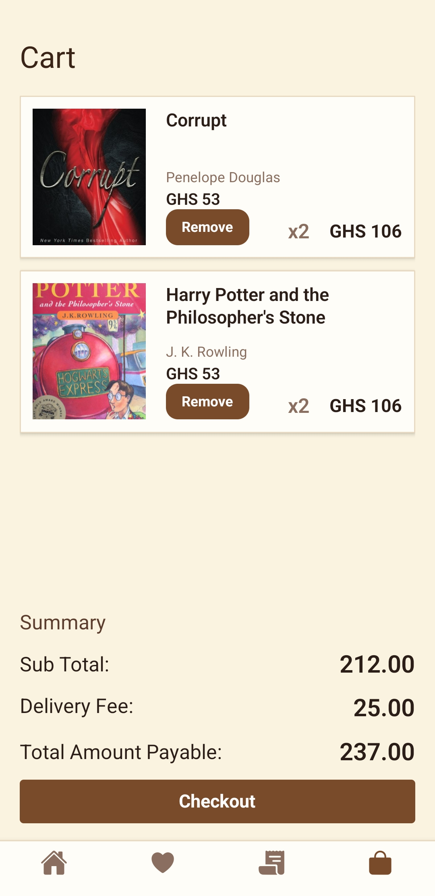
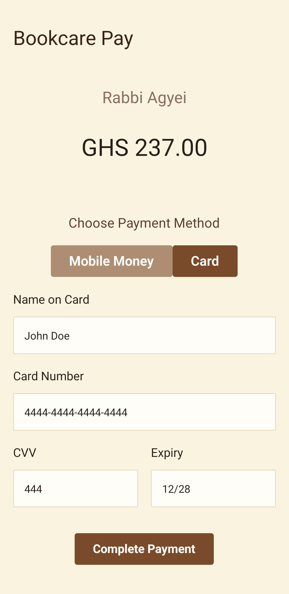
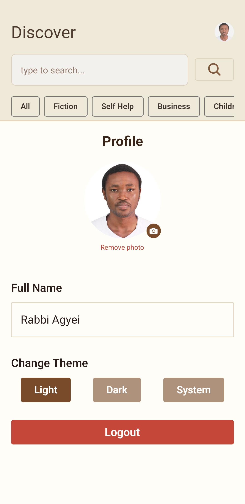

# Bookcare 📚
> *Your story starts here.*

## Description

Bookcare is a full-featured mobile bookstore e-commerce application built with React Native and Expo. It allows users to browse thousands of real books powered by the Open Library API, add books to their cart or wishlist, and place simulated orders with delivery tracking. The app supports both light and dark mode, provides a smooth and responsive experience across Android and iOS, and includes user authentication via Supabase.

---

## Features Implemented

- **Authentication** — Email/password registration, login, and OTP email verification via Supabase Auth
- **Discover / Home Screen** — Trending and Popular book sections with horizontal scroll, category filtering, and book search
- **Book Detail Screen** — Full book information including description with read more, author info, related books, and add to cart
- **Cart** — Add, remove, increase and decrease item quantities with persistent storage via AsyncStorage
- **Wishlist** — Save and remove books with persistent local storage via Zustand + AsyncStorage
- **Checkout / Bookcare Pay** — Simulated payment flow with Mobile Money and card options, delivery fee calculation, and order placement
- **Orders** — Full order history stored in Supabase with simulated delivery status tracking
- **Order Detail** — Itemised order breakdown with buy again functionality
- **Profile** — Avatar with image picker, name from session, dark/light/system theme toggle, and logout
- **Dark Mode** — Full dark mode support with system, light, and dark options persisted across sessions
- **Pull To Refresh** — Home and Orders screens support pull to refresh via TanStack Query
- **Haptic Feedback** — Light haptics on navigation, success haptics on cart and order actions
- **Toast Notifications** — Success and error feedback via Sonner Native throughout the app
- **Skeleton Loading** — Custom animated skeleton placeholders during data fetching
- **Empty States** — Friendly empty state UI for wishlist, orders, search, and categories

---

## Tech Stack

| Category | Technology |
|---|---|
| Framework | React Native (Expo SDK 54, Managed Workflow) |
| Navigation | Expo Router (file-based routing) |
| Styling | NativeWind v4 (TailwindCSS for React Native) |
| UI Components | Gluestack UI v3 (selectively — Button, Skeleton) |
| State Management | Zustand with AsyncStorage persistence |
| Server State | TanStack Query (React Query v5) |
| Authentication | Supabase Auth (email OTP, session management) |
| Database | Supabase (PostgreSQL — orders and order items) |
| Book Data | Open Library API (free, no key required) |
| Local Storage | AsyncStorage (cart, wishlist, theme, profile image) |
| Secure Storage | Expo SecureStore (Supabase session tokens) |
| Images | Expo Image (disk caching, blurhash placeholders) |
| Animations | React Native Reanimated v4 (skeleton pulse) |
| Lists | FlashList by Shopify (performant list rendering) |
| Forms | React Hook Form + Zod (login and registration) |
| Haptics | Expo Haptics |
| Toasts | Sonner Native |
| Icons | Expo Vector Icons (Ionicons) |

---

## Folder Structure Explanation

```
bookcare/
├── app/                          # Expo Router screens (file-based routing)
│   ├── _layout.tsx               # Root layout — auth guard, providers, splash
│   ├── index.tsx                 # Entry point — controls routing on launch
│   ├── (auth)/                   # Auth group — unauthenticated screens
│   │   ├── _layout.tsx
│   │   ├── login.tsx
│   │   ├── signup.tsx
│   │   └── confirmsignup.tsx     # OTP verification
│   ├── (tabs)/                   # Tab group — main authenticated screens
│   │   ├── _layout.tsx           # Tab bar configuration
│   │   ├── index.tsx             # Discover / Home
│   │   ├── wishlist.tsx
│   │   ├── orders.tsx
│   │   └── cart.tsx
│   ├── (checkout)/               # Checkout group
│   │   ├── index.tsx             # Bookcare Pay screen
│   │   └── confirmation.tsx      # Order success screen
│   ├── (orders)/
│   │   └── [id].tsx              # Order detail screen (dynamic route)
│   └── book/
│       └── [id].tsx              # Book detail screen (dynamic route)
│
├── assets/                       # Static assets
│   ├── bookcare-app-icon.png
│   ├── bookcare-splash-dark.png
│   ├── bookcare-splash-light.png
│   └── splash-icon.png
│
├── screenshots/                  # App screenshots for README
│
├── components/ui/                # Gluestack generated UI components
│   ├── button/
│   ├── gluestack-ui-provider/
│   └── icon/
│
├── src/
│   ├── components/               # Reusable components split by domain
│   │   ├── books/                # BookCard, SkeletonBookCard, WishlistedBook
│   │   ├── cart/                 # CartItemCard
│   │   ├── checkout/             # CardPaymentMethod, MobileMoneyCard
│   │   ├── common/               # BookList (FlashList wrapper), CartBottomModal, Skeleton
│   │   ├── orders/               # OrderCard, OrderCardItem
│   │   ├── profile/              # ProfileModal
│   │   └── ui/                   # Shared generic UI components
│   │
│   ├── constants/                # App-wide constants
│   │   ├── books.ts              # Book-related constants
│   │   ├── categories.ts         # Book category definitions with labels and values
│   │   ├── colors.ts             # Full Bookcare color palette
│   │   ├── services.ts           # API base URLs and config
│   │   ├── spacing.ts            # Spacing scale
│   │   ├── typography.ts         # Font sizes and weights
│   │   └── index.ts              # Barrel export
│   │
│   ├── hooks/                    # Custom hooks
│   │   ├── tanstackQueryHooks.ts # All TanStack Query hooks — books, orders
│   │   └── index.ts              # Barrel export
│   │
│   ├── lib/                      # Third party client setup
│   │   ├── supabase.ts           # Supabase client with SecureStore adapter
│   │   └── queryClient.ts        # TanStack Query client configuration
│   │
│   ├── schemas/                  # Zod validation schemas
│   │   ├── authSchemas.ts        # Login and registration schemas
│   │   └── index.ts
│   │
│   ├── services/                 # API service functions
│   │   ├── bookService.ts        # Open Library book fetch functions
│   │   ├── homeService.ts        # Trending, popular, subject fetch functions
│   │   └── index.ts              # Barrel export
│   │
│   ├── store/                    # Zustand stores
│   │   ├── useAuthStore.ts       # Session, initialize, sign out
│   │   ├── useCartStore.ts       # Cart items, add, remove, quantity
│   │   ├── useWishlistStore.ts   # Wishlist items, add, remove
│   │   ├── useThemeStore.ts      # Light, dark, system mode
│   │   ├── useProfileStore.ts    # Profile image
│   │   ├── useCartBottomSheetStore.ts  # Cart modal open/close + item
│   │   └── index.ts              # Barrel export
│   │
│   ├── types/                    # TypeScript type definitions
│   │   ├── authTypes.ts
│   │   ├── cartTypes.ts
│   │   ├── checkoutTypes.ts
│   │   ├── orderTypes.ts
│   │   ├── profileTypes.ts
│   │   ├── serviceTypes.ts
│   │   ├── themeTypes.ts
│   │   ├── wishlistTypes.ts
│   │   └── index.ts
│   │
│   └── utils/                    # Pure utility functions
│       ├── cartUtils.ts          # Cart calculations — totals, delivery fee
│       ├── cn.ts                 # Class name helper
│       ├── orderUtils.ts         # Order status derivation, date formatting
│       ├── productUtils.ts       # derivePrice, deriveRating, getBookCoverUrl
│       ├── serviceUtils.ts       # API response helpers, getDescription
│       └── index.ts              # Barrel export
│
├── global.css                    # NativeWind base styles
├── tailwind.config.js            # Tailwind + Bookcare custom colors
├── metro.config.js               # Metro bundler with NativeWind
├── babel.config.js               # Babel with Worklets plugin
├── app.json                      # Expo configuration with splash and icons
├── eas.json                      # EAS Build configuration
└── tsconfig.json                 # TypeScript configuration
```

**Why this structure:**
- `app/` follows Expo Router's file-based convention — routing is automatic and the folder hierarchy directly reflects the navigation structure
- Route groups like `(auth)`, `(tabs)`, `(checkout)` and `(orders)` organize screens by access level and flow without affecting the URL structure
- `src/` separates all application logic from routing — components, stores, hooks, and utils are reusable regardless of how routing changes
- Domain-based component folders (`books/`, `cart/`, `orders/`) keep related components together and make it easy to find what belongs where
- `services/` isolates all API calls — if the Open Library API changes, there is one place to update
- `schemas/` keeps validation logic separate from components — forms stay clean and schemas are reusable
- Zustand stores are split by concern — each store owns exactly one domain of state, preventing stores from becoming bloated
- `utils/` contains only pure functions with no side effects — easy to test and reuse anywhere in the app

---

## Screenshots

| Screen | Light | Dark |
|---|---|---|
| Splash |  |  |
| Login |  | |
| Home |  |  |
| Product Detail |  | |
| Cart |  | |
| Checkout |  | |
| Profile |  | |

---

## Optimization Techniques Used

### React.memo
Applied to all list item components to prevent unnecessary re-renders when the parent component updates but the item's props have not changed:

- **BookCard** — memoized because it renders inside FlashList. Without memo, every scroll event or state change in the home screen would re-render every visible card.
- **OrderCard** — memoized for the same reason inside the orders FlashList.
- **BookCardSkeleton** — memoized because multiple instances render simultaneously during loading.
- **CartItem** — memoized inside the cart list. Cart state updates (quantity change on one item) would otherwise re-render every other item in the list.

### useCallback
Applied to functions that are passed as props to memoized components. Without useCallback, a new function reference is created on every render which causes memo to think props changed and re-render anyway:

- **handleBookPress** in Home and Wishlist screens — passed to BookCard's onPress. Wrapped in useCallback with an empty dependency array since the navigation logic never changes.
- **handleRefresh** in Home and Orders screens — passed to RefreshControl's onRefresh. Wrapped in useCallback to prevent RefreshControl from re-rendering on every parent render.
- **handleAddToCart / handleRemove** in Cart screen — passed to CartItem components.

### useMemo
Applied to expensive derived values that would otherwise recalculate on every render:

- **displayBooks** in Home screen — determines which books to show based on search state, selected category, and fetched data. Without useMemo this filter runs on every keystroke and state change.
- **cartTotal** in Cart and Checkout screens — reduces over all cart items to calculate subtotal. Memoized so it only recalculates when cart items actually change.
- **deliveryFee** in Checkout — derived from cart total, memoized to stay stable while user interacts with payment method selection.

### Additional Performance Decisions
- **TanStack Query caching** — all Open Library API responses are cached for 5 minutes. Navigating away and back to a screen serves data instantly from cache with zero additional network requests.
- **Expo Image disk caching** — book cover images are cached to disk permanently. Covers load from network once and never again across app restarts.
- **FlashList over FlatList** — all lists use Shopify's FlashList which recycles components instead of creating and destroying them, significantly reducing memory usage and improving scroll performance on large book lists.
- **Zustand selectors** — all Zustand state access uses selector functions to ensure components only re-render when the specific slice of state they depend on changes, not when any part of the store updates.

---

## Challenges Faced

### NativeWind and TextInput Ref Forwarding
One of the most frustrating issues was that refs on `TextInput` components were returning null even with correct usage. After extensive debugging I discovered that NativeWind v4's `cssInterop` wraps native components internally, which breaks React's ref forwarding mechanism. The fix was upgrading to a specific NativeWind patch version where this regression was corrected. This taught me that third-party styling libraries that wrap native components can have non-obvious effects on lower level React Native APIs.

### Gorhom Bottom Sheet and Reanimated v4 Compatibility
I initially planned to use Gorhom's bottom sheet for the cart quick-add sheet. After hours of debugging where the sheet simply would not appear, I discovered through GitHub issues that Gorhom bottom sheet has a known incompatibility with Reanimated v4 which ships with Expo SDK 54. Rather than downgrading Reanimated and potentially breaking my skeleton animations, I switched to React Native's built-in Modal with Expo Blur for the backdrop. This was a pragmatic decision under deadline pressure and produced a result that looks and feels identical to users.

### Open Library API Inconsistencies
The Open Library API returns inconsistent data shapes across different books. The description field for example sometimes returns a plain string and sometimes returns an object with a `value` property. Some books have no author key, some have no cover ID, some have empty arrays where objects are expected. Every single field required defensive optional chaining and nullish coalescing to prevent crashes. Building a `getDescription` utility and adding `?.[0]` array access throughout the codebase fixed this but required careful attention to every field.

### Zustand Infinite Re-renders
When selecting multiple values from a Zustand store by returning a plain object from the selector, the selector returns a new object reference on every render causing an infinite loop. The fix was selecting each value with its own individual selector call. This was a subtle bug that took time to identify because the error message pointed to the component rather than the store.

### Managing Multiple API Calls on One Screen
The home screen makes parallel API calls for trending books, popular books, and category books simultaneously. Coordinating loading states, error states, and cache invalidation across multiple TanStack Query hooks while keeping the UI responsive required careful use of `useQueries`, independent loading indicators per section, and `isRefetching` for pull to refresh rather than `isLoading` which only fires on the initial fetch.

### Supabase Row Level Security
Setting up RLS policies was initially confusing because enabling RLS and creating policies are two separate steps — enabling RLS without policies locks the table completely. Additionally Postgres silently lowercases all unquoted column names which caused mismatches between my JavaScript camelCase and the database column names. Understanding the difference between `USING` for read operations and `WITH CHECK` for write operations also took time to get right.
